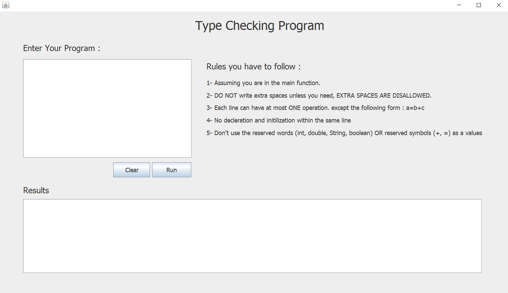

# Compiler-project
My compiler project 

This project consists of three sub projects :

1- lexical analysis.
which contains: 
1) converting from Regular Expression to NFA (Non-deterministic Finite Automata).
2) converting from NFA to DFA(Deterministic Finite Automata).

2- LR1 Parsing.
which contains:            
1) parses any word (take the word as an input) that can be generated from a given grammer.
2) showing the algorithm excution steps during parsing whether the word can be generated from the grammer or not.
3) showing correct parsing steps to generate the given word if it's can be generated from the given grammer.

3- Type checking.
which contains: 
1) accepting a source code and checks if it has type checking errors or not by using 6 grammer rules.
2) showing excution steps while processing the input code.
         
 -----------------------------------------------------------------------------------------------------
 
 Screenshots for the three main interfaces :
 
 
 
 
 
 
 
 -----------------------------------------------------------------------------------------------------
 
(( TO EXCUTE THE PROJECT ))
There are three packages :  
Lexical analysis, LR1 parsing AND Type checking
                
( in order each on )
---> there is a MAIN file in each package.
---> RUN THIS MAIN FILE.
